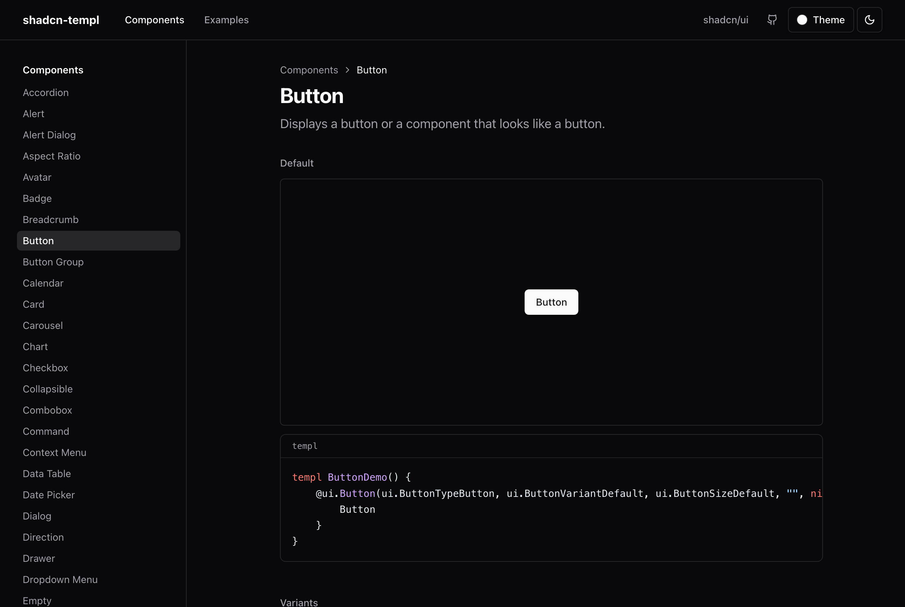
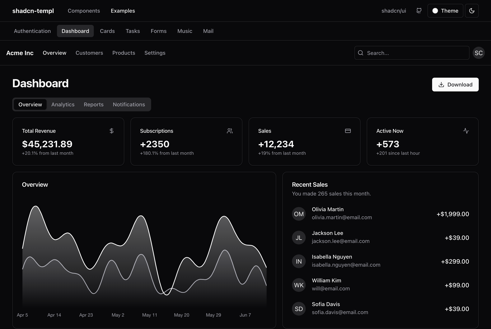
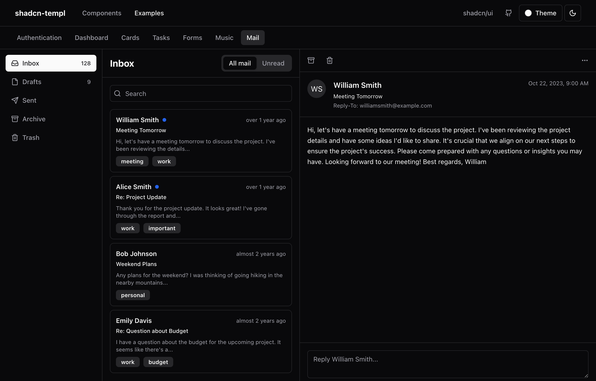
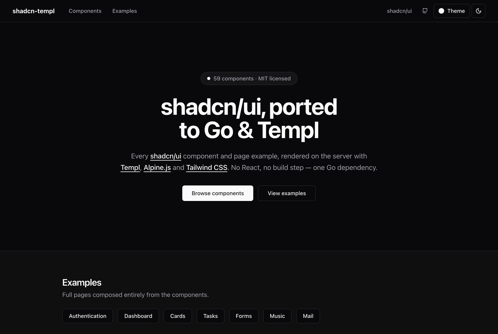
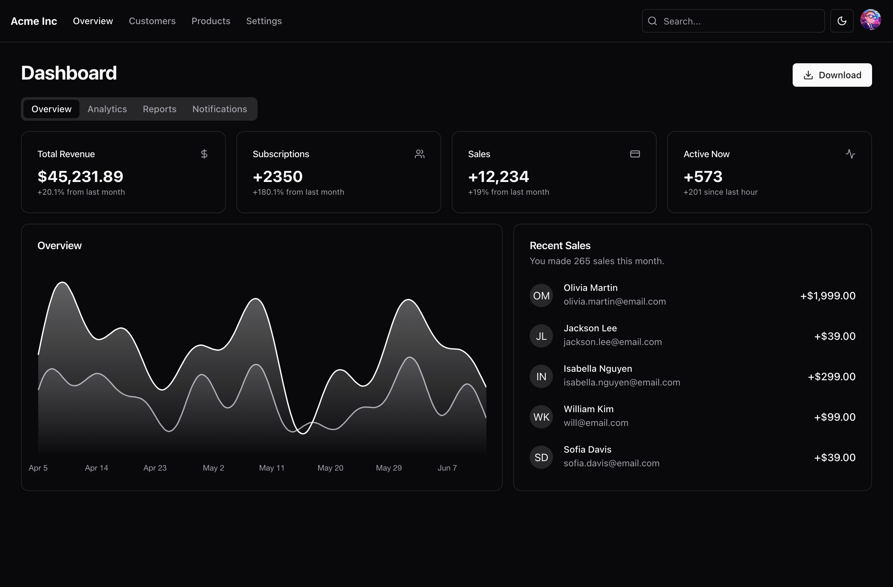

# shadcn-templ

[](https://github.com/davidbudnick/shadcn-templ/actions/workflows/go.yml)
[](https://github.com/davidbudnick/shadcn-templ/actions/workflows/pages.yml)
[](https://pkg.go.dev/github.com/davidbudnick/shadcn-templ)
[](https://goreportcard.com/report/github.com/davidbudnick/shadcn-templ)
[](https://opensource.org/licenses/MIT)

A complete port of [shadcn/ui](https://ui.shadcn.com/) to **Go**, **[Templ](https://templ.guide/)**, **[Alpine.js](https://alpinejs.dev/)** and **[Tailwind CSS](https://tailwindcss.com/)** — every component and page example, rendered on the server. No React and no Node build step; interactivity is sprinkled in with Alpine.js, and charts use Chart.js — both loaded from a CDN, so the Go module itself has a single dependency (`a-h/templ`).

**Live demo:** https://davidbudnick.github.io/shadcn-templ/

## Screenshots

| Components | Dashboard example |
| --- | --- |
|  |  |

| Mail example | Landing |
| --- | --- |
|  |  |

## Features

**Components**
- All **59** components from the shadcn/ui docs, matching the same Tailwind design tokens and markup.
- Interactive components (Dialog, Dropdown Menu, Tabs, Accordion, Popover, Command, Combobox, Carousel, Calendar, Data Table, …) powered by **Alpine.js** — sprinkled in, not a SPA.
- Complex React-only components (Data Table, Calendar, Resizable, Sonner) reimplemented **natively** in Go + Alpine; charts use Chart.js (CDN, client-side).

**Developer experience**
- Idiomatic, consistent API: every component takes a `classes string` (conflict-merged with the component's base classes) and `attrs templ.Attributes`.
- **One dependency.** The module depends only on [`a-h/templ`](https://github.com/a-h/templ). The Tailwind class-merger is vendored into `internal/` and syntax highlighting is a small in-tree tokenizer — no third-party supply chain.
- Ships compiled CSS embedded in the module — drop it in and serve one stylesheet.
- Dark mode out of the box via a tiny theme script.

**Theming**
- Dark mode out of the box, plus the shadcn/ui accent **color themes** (Zinc, Red, Rose, Orange, Green, Blue, Yellow, Violet) — switch live and persist the choice.
- CSS-variable based (`--primary`, `--ring`, …): override the tokens in your own CSS to fully customize.

**Docs & hosting**
- A full documentation site that shows a **live preview and the Go/templ source** for every component (so it's obvious how to use each one), plus the eight shadcn/ui page examples. Run it locally or export to a **static site** for free hosting on GitHub Pages.
- An [`AGENTS.md`](AGENTS.md) skill file gives AI assistants (Claude Code, Cursor, …) project-aware knowledge of the API and conventions.
- Tested: every component and example is render-tested, and a test cross-references the registry against the shadcn/ui docs so the port can't fall behind.

## Components

Accordion · Alert · Alert Dialog · Aspect Ratio · Avatar · Badge · Breadcrumb · Button · Button Group · Calendar · Card · Carousel · Chart · Checkbox · Collapsible · Combobox · Command · Context Menu · Data Table · Date Picker · Dialog · Direction · Drawer · Dropdown Menu · Empty · Field · Hover Card · Input · Input Group · Input OTP · Item · Kbd · Label · Menubar · Native Select · Navigation Menu · Pagination · Popover · Progress · Radio Group · Resizable · Scroll Area · Select · Separator · Sheet · Sidebar · Skeleton · Slider · Sonner · Spinner · Switch · Table · Tabs · Textarea · Toast · Toggle · Toggle Group · Tooltip · Typography

## Installation

```sh
go get github.com/davidbudnick/shadcn-templ
```

Requires Go 1.23+. Components are `.templ`; if you author your own templates you'll also want the [templ CLI](https://templ.guide/quick-start/installation).

## Usage

Add the `Head` component to your `<head>` (it loads Alpine.js and the theme script) and serve the embedded `CSS`:

```go
import shadcntempl "github.com/davidbudnick/shadcn-templ"

// Serve the compiled stylesheet.
mux.HandleFunc("GET /static/css/styles.css", func(w http.ResponseWriter, r *http.Request) {
	w.Header().Set("Content-Type", "text/css")
	w.Write(shadcntempl.CSS)
})
```

```templ
templ Layout() {
	<!DOCTYPE html>
	<html lang="en">
		<head>
			@shadcntempl.Head()
			<link rel="stylesheet" href="/static/css/styles.css"/>
		</head>
		<body>
			{ children... }
		</body>
	</html>
}
```

Use components in your `.templ` files:

```templ
import "github.com/davidbudnick/shadcn-templ/ui"

templ Page() {
	@ui.Button(ui.ButtonTypeButton, ui.ButtonVariantDefault, ui.ButtonSizeDefault, "", nil) {
		Click me
	}
}
```

The trailing `classes` argument is merged with the component's base classes (later utilities win, via tailwind-merge), and `attrs` are spread onto the root element:

```templ
@ui.Button(ui.ButtonTypeButton, ui.ButtonVariantOutline, ui.ButtonSizeDefault,
	"w-full", templ.Attributes{"hx-post": "/save"}) {
	Save
}
```

## Theming

Theming is CSS-variable based, exactly like shadcn/ui.

- **Dark mode** — toggle the `dark` class on `<html>`; `Head()` restores the
  saved preference before paint.
- **Color themes** — set `document.documentElement.dataset.theme` and persist
  `localStorage.themeColor` (`Head()` restores it). All of shadcn/ui's options
  are available: base palettes `slate`, `stone`, `gray`, `neutral` (empty =
  Zinc) and accent colors `red`, `rose`, `orange`, `green`, `blue`, `yellow`,
  `violet`.

To customize further, override the semantic tokens (`--background`,
`--foreground`, `--primary`, `--ring`, …) under `:root` / `.dark` in your CSS —
no component classes need to change.

## AI assistants

[`AGENTS.md`](AGENTS.md) is a skill file that teaches AI assistants (Claude
Code, Cursor, Copilot, …) how to use this library: the API conventions, the
Alpine.js trigger patterns, theming and where the demos live. Most agentic
tools pick it up automatically.

## Examples

The docs site reproduces the full shadcn/ui **Examples**:

> Authentication · Dashboard · Cards · Tasks · Forms · Music · Mail

Run the site locally:

```sh
make examples   # http://localhost:8080
```

## Documentation site & hosting

The docs are a static site, so hosting is free. Export it and deploy the `dist/` folder anywhere:

```sh
make site                     # -> ./dist (links at the domain root)
make site BASE=/shadcn-templ  # for a GitHub Pages project site
```

### GitHub Pages

`.github/workflows/pages.yml` builds and deploys the docs on every push to
`main` (Settings → Pages → Source: GitHub Actions). The live site is at
**https://davidbudnick.github.io/shadcn-templ/** — the workflow passes the repo
name as the base path automatically.

## Development

The Tailwind standalone CLI compiles the CSS. Download it once (git-ignored) — pick your platform from the [releases](https://github.com/tailwindlabs/tailwindcss/releases/tag/v3.4.17):

```sh
curl -sL -o tailwindcss \
	https://github.com/tailwindlabs/tailwindcss/releases/download/v3.4.17/tailwindcss-macos-arm64
chmod +x tailwindcss
```

Make targets:

| Command | Description |
| --- | --- |
| `make gen` | Run `templ generate` and compile the CSS |
| `make examples` | Run the docs site at `:8080` |
| `make example` | Run the minimal starter app at `:8081` |
| `make site` | Export the static docs site to `./dist` |
| `make tailwind` | Compile the CSS only |
| `make test` | Run the tests |
| `make verify` | `gen` + build + test + vet |

## Project structure

```
.
├── ui/              # the component library (one .templ per component)
├── icons/           # Lucide icons as templ components
├── static/css/      # Tailwind input + compiled output (embedded via css.go)
├── include.templ    # <Head> — Alpine.js + theme script
├── css.go           # embeds the compiled stylesheet
├── cmd/examples/    # the documentation / examples site + static-site generator
├── example/         # a minimal standalone app that consumes the library
└── AGENTS.md        # skill file for AI assistants
```

### Starter example

[`example/`](example/) is the smallest realistic app built on the library — a
feedback form with dark mode, served from a tiny `main.go`. It's the best place
to copy from when starting your own project:

```sh
make example   # http://localhost:8081
```



## Continuous integration

- **`go.yml`** — on every push/PR: regenerates templ, fails if committed generated code is stale, then builds, vets and runs tests with the race detector.
- **`pages.yml`** — on push to `main`: builds the CSS and the static docs site and deploys it to GitHub Pages.

## Requirements

- Go 1.23+
- [templ](https://templ.guide/) and the Tailwind standalone CLI (for development only)

## License

[MIT](LICENSE)

## Acknowledgments

- [shadcn/ui](https://ui.shadcn.com/) — the original design system this ports.
- [Templ](https://templ.guide/), [Alpine.js](https://alpinejs.dev/) and [Tailwind CSS](https://tailwindcss.com/).
- The vendored class-merger in `internal/` is a copy of [tailwind-merge-go](https://github.com/Oudwins/tailwind-merge-go) (MIT).
- Inspired by [rotemhoresh/shadcn-templ](https://github.com/rotemhoresh/shadcn-templ).
